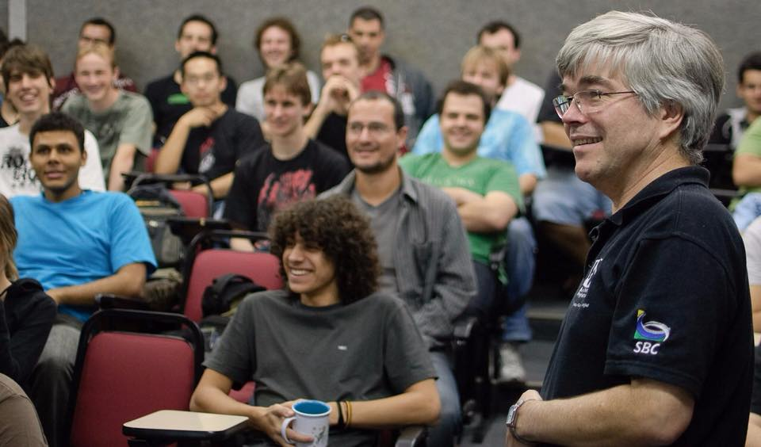

# ArchSims

Simulators for use in computer architecture classes.

## Overview

This project is a [_clean room_](https://en.wikipedia.org/wiki/Clean_room_design) implementation of the [hypothetical machines](https://pt.wikipedia.org/wiki/M%C3%A1quinas_hipot%C3%A9ticas_da_Universidade_Federal_do_Rio_Grande_do_Sul) used in computer architecture classes at the [Institute of Informatics](http://www.inf.ufrgs.br) of Universidade Federal do Rio Grande do Sul.

The goal is to faithfully recreate the [instruction set architecture](https://en.wikipedia.org/wiki/Instruction_set_architecture) for all machines. To accomplish this, the code has extensive test coverage. Each implementation was made following the original specifications provided by professors Raul Fernando Weber and Taisy Silva Weber.

There is no UI, but there are plans to create one in the future.

## Content

This repository contains:

  - Implementations for Neander, Ramses, and Cesar
  - Assemblers for Ramses and Cesar
  - A Ramses emulator for Cesar (_it was a cold and rainy day..._)
  - Thorough test cases
    - An adapter to test the Ramses emulator with the same test cases used for Ramses
  - A command-line utility for simple demos

## Prerequisites

  - .NET Core 2.0

## To run the tests

```
dotnet test
```

## To run the samples

Run the `.cmd` scripts from the `Samples` folder (Windows only).

## Special thanks

  - Prof. Raul Fernando Weber (_in memoriam_)


