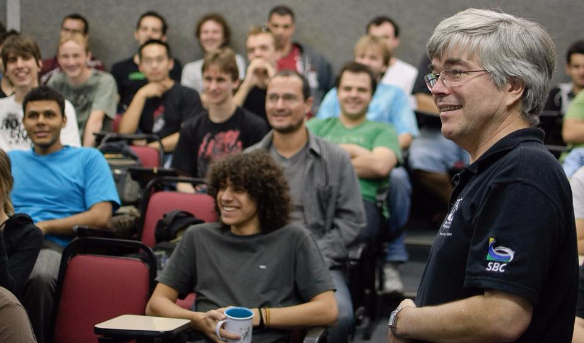

# ArchSims

Simulators for use in computer architecture classes.

## Overview

This project is a [_clean room_](https://en.wikipedia.org/wiki/Clean_room_design) implementation of the [hypothetical machines](https://pt.wikipedia.org/wiki/M%C3%A1quinas_hipot%C3%A9ticas_da_Universidade_Federal_do_Rio_Grande_do_Sul) used in computer architecture classes at the [Institute of Informatics](http://www.inf.ufrgs.br) of Universidade Federal do Rio Grande do Sul.

The goal is to faithfully recreate the [instruction set architecture](https://en.wikipedia.org/wiki/Instruction_set_architecture) of each machine. To that end, every implementation is backed by an extensive test suite and follows the original specifications provided by professors Raul Fernando Weber and Taisy Silva Weber.

The four machines form a progression of increasing complexity:

| Machine | Width  | Highlights                                                                 | Manual                       |
| ------- | ------ | -------------------------------------------------------------------------- | ---------------------------- |
| Neander | 8-bit  | Baseline: single accumulator, one addressing mode, `N`/`Z` flags           | [doc/Neander.md](doc/Neander.md) |
| Ahmes   | 8-bit  | Adds `SUB`, shifts, rotates, `C`/`V`/`B` flags, extended conditional jumps | [doc/Ahmes.md](doc/Ahmes.md)     |
| Ramses  | 8-bit  | Multiple registers (`RA`/`RB`/`RX`), four addressing modes, `JSR`          | [doc/Ramses.md](doc/Ramses.md)   |
| Cesar   | 16-bit | Eight registers, eight addressing modes, stack, memory-mapped I/O          | [doc/Cesar.md](doc/Cesar.md)     |

Each manual documents the programmer's model, instruction set, execution cycle, and UI design suggestions.

There is no UI yet, but there are plans to create one in the future.

## Content

This repository contains:

  - Core implementations for Neander, Ahmes, Ramses, and Cesar ([fs/ArchSims.Core](fs/ArchSims.Core))
  - Assemblers for Ramses and Cesar ([fs/ArchSims.Assemblers](fs/ArchSims.Assemblers))
    - Neander and Ahmes ship without an assembler (by design)
  - A Ramses emulator for Cesar (_it was a cold and rainy day..._)
  - Thorough test cases ([fs/ArchSims.Core.Tests](fs/ArchSims.Core.Tests))
    - An adapter to test the Ramses emulator with the same test cases used for Ramses
  - A command-line utility for simple demos ([fs/ArchSims.CmdLine](fs/ArchSims.CmdLine))

## Prerequisites

  - .NET 9

## To run the tests

```
dotnet test
```

## To run the samples

Run the `.cmd` scripts from the [Samples](Samples) folder (Windows only).

## Special thanks

  - Prof. Raul Fernando Weber (_in memoriam_)


